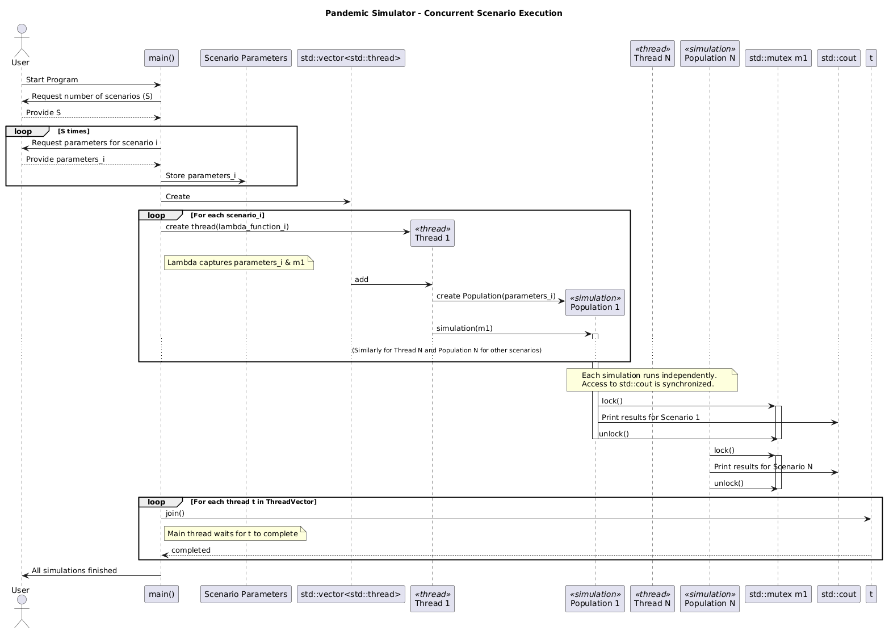

<div align="center">
  <h1>Evidence 4 - Pandemic Simulator</h1>
</div>

To run the simulator:

```
g++ main.cpp
```

To run the tests:

```
g++ tests.cpp
```

For my final project of the Object Oriented Programming course during second semester, I built a pandemic simulator. As cool as I though it was, the real value of tools like this one relies on the ability to run multiple different scenarios to make informed decisions. However, between the amount of inputs needed to run a simulation, as well as the computational demands, the program couldn't be properly used as a tool to assess decision-making based on simulating multiple scenarios. 

The moment we saw the concurrent and parallel programming paradigms, I thought it would be a great improvement to my pandemic simulator, as I could use threads to simulate multiple scenarios at the same time.

## Threads

Contrary to popular missinterpreation, a thread is not a process.

A thread is the smallest unit of CPU execution within a process. It contains its own program counter, register set, and stack, but shares the process's memory and resources with other threads.

Threads enable a program to perform multiple tasks concurrently. In my simulator, each thread is responsible for handling an individual simulation scenario, allowing multiple scenarios to be processed simultaneously, especially on multi-core processors. This design improves performance by overlapping computation and making efficient use of system resources.

## Concurrency 

Concurrency is a programming paradigm where multiple tasks are designed to make progress in overlapping time periods.

The idea is to structure a program to handle many things at once, even if they aren't all executing at the exact same physical moment. This is useful for:

- Server Management: Handling multiple client connections simultaneously.
- Simulations: Organizing different components or scenarios that can logically operate independently.

## Parallelism

Parallelism, on the other hand, refers to the simultaneous execution of multiple tasks at the exact same physical moment. This requires CPUs with multiple cores.

The intention of parallelism is to improve performance by literally doing more work in the same amount of time. This is mostly used for programs that require executing lots of matrix operations, like neural networks or videogame graphic engines.


In simpler terms, parallelism is a subset of concurrency. We can't have have parallelism without concurrency, because we need the program to first express multiple tasks that can be run independently. 


----

This pandemic simulator uses concurrency by using the threads to manage multiple simulation scenarios. 


For each simulation scenario requested by the user, the program creates a new thread. Each thread will be an independent path of execution responsible for a single scenario.


* Within each thread:
    *   A Population object is instantiated with its specific parameters.
    *   The simulation() method runs the  logic of the pandemic simulation for that scenario.

By structuring the simulations to run in separate threads, the program allows the operating system to execute these threads in parallel if multiple CPU cores are available. We use the join() method to ensure that the main program waits for all simulation threads to complete their execution before it finishes.

The following sequence diagram makes it easier to understand:




1.  **Initialization and Input Gathering:**
    *   The User starts the program.
    *   Main.cpp asks the User for the total number of scenarios (S) to simulate.
    *   In a loop repeated S times, Main.cpp asks the User for the specific parameters for each scenario.

2.  **Thread Creation and Launch:**
    *   Main.cpp creates the thread vector to manage the worker threads.
    *   For each set of scenario_i parameters:
        *   Main.cpp creates a new thread. The task for this thread is defined by a lambda function.
        *   The lambda function captures the specific scenario's parameters ((sc) in Main.cpp) and has access to the mutex m1 (which is global in Main.cpp, so it's accessible without explicit capture in the lambda's capture list []).
        *   The newly created thread is added to the thread vector.
        *   The thread (T1) then creates its corresponding Population object (P1) using its captured parameters_i.
        *   The thread calls the simulation(m1) method on its Population object, passing the mutex. This starts the actual simulation logic for that scenario, and P1 becomes active.
        *   This process is repeated for all N scenarios, leading to N threads running simulations concurrently.

3.  **Concurrent Simulation and Synchronized Output:**
    *   Multiple Population simulations (P1 through PN) execute concurrently.
    *   When a Population object needs to print its results:
        *   It first calls lock() on the Mutex (m1), acquiring exclusive access.
        *   It then prints its results.
        *   Finally, it calls unlock() on the Mutex, releasing it for other threads.
    *   This locking mechanism ensures that output from different threads doesn't get mixed up.

4.  **Joining Threads:**
    *   After launching all simulation threads, Main.cpp iterates through the thread vector.
    *   For each thread t in the vector, Main.cpp calls t.join(), which blocks the Main.cpp thread until the specified worker thread (t) has finished its execution (in other words, until its simulation is complete).

5.  **Completion:**
    *   Once all worker threads have been joined (meaning all simulations have finished), Main.cpp informs the User that all simulations are complete.

## SIR Model

The SIR mathematical model is used for describing the spread of infectious diseases within a population. It divides the population into three groups:

- **Susceptible (S)**: Individuals who are not infected but can get infected.
- **Infectious (I)**: Individuals who are currently infected and can transmit the disease.
- **Removed (R)**: Individuals who have either recovered or died from the disease.


## Differential Equations

The SIR model is described by the following set of differential equations:

1. **Susceptible Population (S)**:
   $\frac{dS}{dt} = -\beta \frac{SI}{N}$


2. **Infected Population (I)**:
   $\frac{dI}{dt} = \beta \frac{SI}{N} - \gamma I$

3. **Recovered Population (R)**:
   $\frac{dR}{dt} = \gamma I$

> Where $\beta$ is the transmission rate and $\gamma$ is the recovery rate.

In order to solve the differential equations, thus allowing us to know the number of susceptibles, infected, and removed individuals at a particular momment in time, I used Euler's numeric method:

1. **Susceptible Population (S)**:
   ${S_{n+1}} = {S_n}-\beta {S_nI_n \Delta t}$


2. **Infected Population (I)**:
   ${I_{n+1}} = {I_n}+ (\beta {S_nI_n - \gamma I_n \Delta t})$

3. **Recovered Population (R)**:
   ${R_{n+1}} = {R_n} + {\gamma I_n \Delta t}$


## Functionality

The user can set:

*  Average age of the population (affects transmission rate)
*  Variant of the virus (affects transmission rate)
*  Percentage of the population that is vaccinated (affects transmission rate)
*  Initial number of infected individuals
*  Number of days to run the simulation

For further customization, you can change the base tranmission rates for each variant in the constructor of the Population.h file.
---

## Algorithmic Complexity

The time complexity of the simulator is primarily determined by the number of simulation scenarios and the number of steps in each scenario. For each scenario, the simulation iterates over a number of steps proportional to the number of days divided by the time increment.

For each scenario, the main simulation loop runs in O(D/dt) time, where D is the number of days to simulate per scenario, and dt is the time step used in Euler's method for the simulation.

Since each scenario runs in its own thread, the total work done is O(S*D/dt), where S is the number of threads or scenarios.
With enough CPU cores, scenarios can be processed in parallel.

The space complexity is also O(D/dt) per scenario, due to the arrays storing the S, I, and R values for each time step.

---

## Python Script: Functional Programming Approach

The Python script (sir_simple.py) uses a functional programming style by structuring the simulation logic as pure functions, passing functions as parameters, and utilizing lambda functions. The main simulation function takes all parameters as input and returns the results without modifying global state, emphasizing immutability and stateless computation. Additionally, the script allows to pass custom functions to modify how each simulation step works or how results are combined, making it highly flexible and easy to experiment with different simulation behaviors. This approach makes the code easier to test, extend, and reason about.

### Difference from C++ Version

- **Python (Functional, Single-threaded):**
  - Uses pure functions.
  - The simulation is sequential (single-threaded), running one scenario at a time.
  - The code is flexible: you can pass custom functions to change how each simulation step works or how results are stored, without modifying the main simulation logic.

- **C++ (Concurrent):**
  - Uses threads to run multiple simulation scenarios concurrently, taking advantage of multi-core CPUs for parallelism.
  - Designed for high performance and scalability when running many scenarios at once.

### Time Complexity

- **Python:** O(D), where D is the number of days simulated. Each step computes new S, I, R values. Only one scenario is simulated at a time.


### Benchmark: Python vs C++

| Version   | Scenarios | Days | Time Step | Runtime (example) |
|-----------|-----------|------|-----------|-------------------|
| Python    | 1         | 100  | 1         | ~0.05s            |
| C++       | 4         | 100  | 1         | ~0.03s (parallel) |

The C++ version is significantly faster when running multiple scenarios due to parallelism. The Python script is best suited for single-scenario simulations or for experimenting with different simulation logic using functional programming techniques.